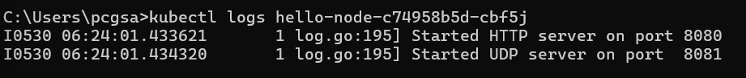
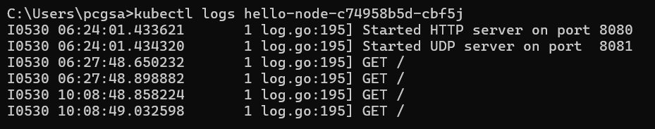

> Compare the application logs before and after you exposed it as a Service.
Try to open the app several times while the proxy into the Service is running.
What do you see in the logs? Does the number of logs increase each time you open the app?

Sebelum saya expose sebagai service, saya hanya melihat log proses startup aplikasi

Setelah saya expose sebagai service, saya mulai melihat log setiap kali aplikasi diakses. Jumlah log tersebut terus bertambah setiap kali saya membuka aplikasinya kembali

> Notice that there are two versions of `kubectl get` invocation during this tutorial section.
The first does not have any option, while the latter has `-n` option with value set to
`kube-system`.

Opsi -n pada perintah kubectl get digunakan untuk menentukan namespace tempat resource Kubernetes berada. Tanpa opsi ini, kubectl secara default akan mencari resource di namespace default. Oleh karena itu, resource seperti pod dan service yang saya buat sendiri tidak muncul saat menggunakan -n kube-system, karena mereka berada di namespace default, bukan di kube-system yang digunakan untuk komponen internal Kubernetes.