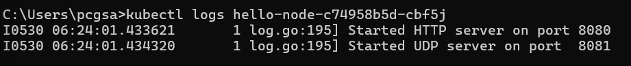
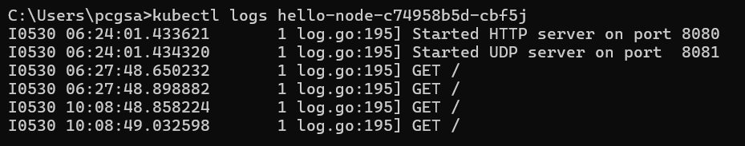
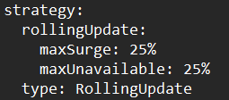
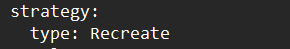
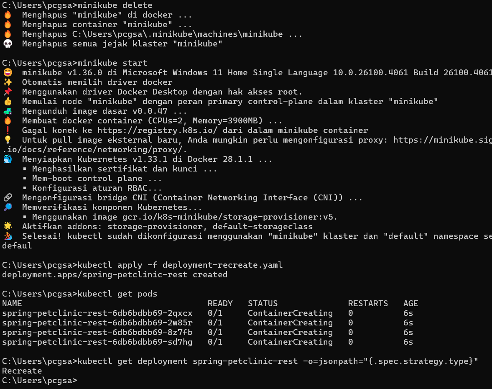

# Advanced Programming Module 11: Deployment and Monitoring

## Reflection Hello Minikube

> Compare the application logs before and after you exposed it as a Service.
Try to open the app several times while the proxy into the Service is running.
What do you see in the logs? Does the number of logs increase each time you open the app?

Sebelum saya expose sebagai service, saya hanya melihat log proses startup aplikasi

Setelah saya expose sebagai service, saya mulai melihat log setiap kali aplikasi diakses. Jumlah log tersebut terus bertambah setiap kali saya membuka aplikasinya kembali

> Notice that there are two versions of `kubectl get` invocation during this tutorial section.
The first does not have any option, while the latter has `-n` option with value set to
`kube-system`.

Opsi -n pada perintah kubectl get digunakan untuk menentukan namespace tempat resource Kubernetes berada. Tanpa opsi ini, kubectl secara default akan mencari resource di namespace default. Oleh karena itu, resource seperti pod dan service yang saya buat sendiri tidak muncul saat menggunakan -n kube-system, karena mereka berada di namespace default, bukan di kube-system yang digunakan untuk komponen internal Kubernetes.

## Reflection Rolling Update Deployment

> What is the difference between Rolling Update and Recreate deployment strategy?

Perbedaannya adalah, pada strategi Rolling Update melakukan pembaruan secara bertahap dengan membuat pod baru satu per satu sambil tetap menjaga pod lama lainnya tetap berjalan.  Sebaliknya, strategi Recreate akan terlebih dahulu menghentikan semua pod lama, lalu membuat pod baru dari versi aplikasi yang diperbarui. Pendekatan ini lebih sederhana, tetapi memiliki risiko downtime (kondisi layanan tidak tersedia) karena tidak ada pod yang berjalan selama masa transisi.

> Try deploying the Spring Petclinic REST using Recreate deployment strategy and document your attempt.

Pertama, saya copy manifest deployment.yaml ke dalam manifest bernama deployment-recreate dengan command `copy deployment.yaml deployment-recreate.yaml`. Setelah itu, saya ganti bagian

Menjadi

Kemudian, saya buat ulang minikube apply manifest tersebut ke cluster menggunakan command
`kubectl apply -f deployment-recreate.yaml`

> Prepare different manifest files for executing Recreate deployment strategy.

Dapat saya lakukan kembali dengan menjalankan command
`kubectl get deployments/spring-petclinic-rest -o yaml >  deployment-recreate.yaml `

>  What do you think are the benefits of using Kubernetes manifest files? Recall your experience
in deploying the app manually and compare it to your experience when deploying the same app
by applying the manifest files (i.e., invoking `kubectl apply -f` command) to the cluster.

Keuntungan menggunakan Kubernetes manifest file adalah proses pembuatan deployment dan service menjadi lebih mudah, cepat, dan mudah diulang. Saat saya melakukan deployment secara manual dengan perintah satu per satu, proses terasa merepotkan dan rentan terhadap kesalahan. Sebaliknya, dengan manifest file, saya cukup menuliskan seluruh konfigurasi dalam satu file YAML dan menjalankan `kubectl apply -f`, deployment dapat dilakukan dalam satu langkah dengan mudah dan cepat. Selain itu, manifest file juga mudah diulang karena dapat disimpan, dibagikan, dan dijalankan kembali kapan saja tanpa perlu mengetik ulang perintah satu per satu.